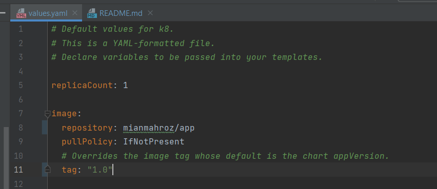
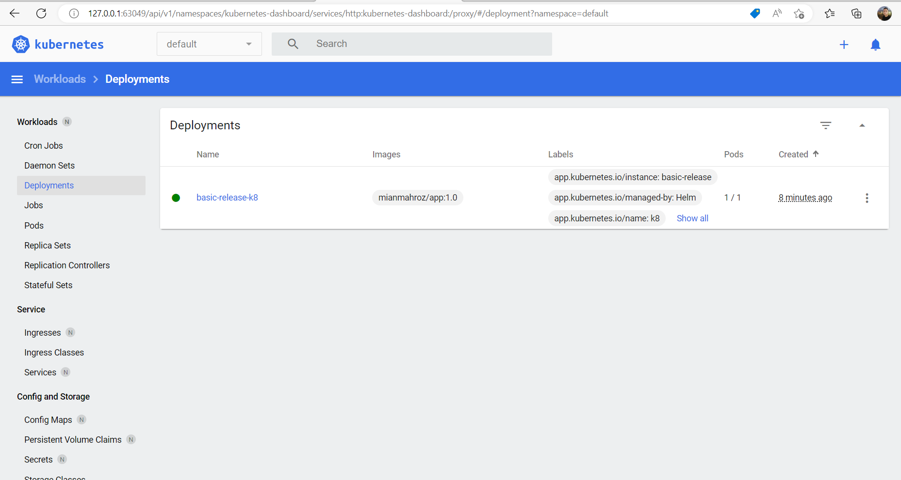
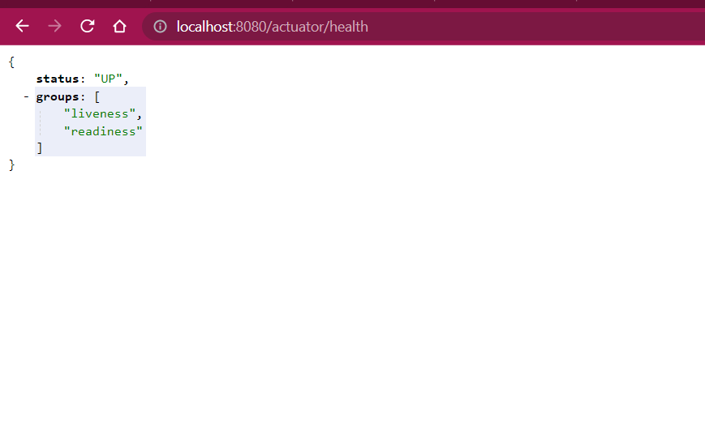
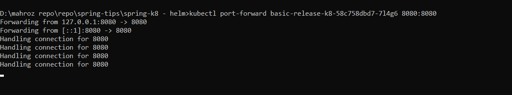

# SPRING BOOT WITH KUBERNETES HELM

#### PRE-REQUISITES
- Docker
- Minikube
- Kubectl
- Helm

#### BUILDING DOCKER IMAGE

- mvnw clean install -DskipTests
- docker build -t app:1.0 .
- docker tag app:1.0 mianmahroz/app:1.0
- docker push mianmahroz/app:1.0
- docker run -p 8080:8080 app:1.0

#### CREATING HELM CHART

- helm create k8      // k8 is dir
- helm lint k8       //validate chart
- helm template k8   //validate template
- helm install -name app-1.0-release k8      // release and dir 
- helm upgrade  basic-release k8
- helm delete basic-release
- helm ls 

#### PORT FORWARDING
- kubectl port-forward {{podName}} 8080:8080 

#### CHART VALUE TO BE UPDATED
- After helm create k8 command, a directory with k8 is created.
- Update image name and tag in values.yaml

