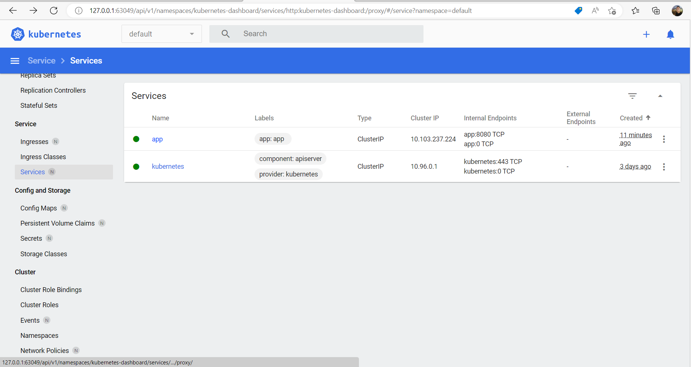
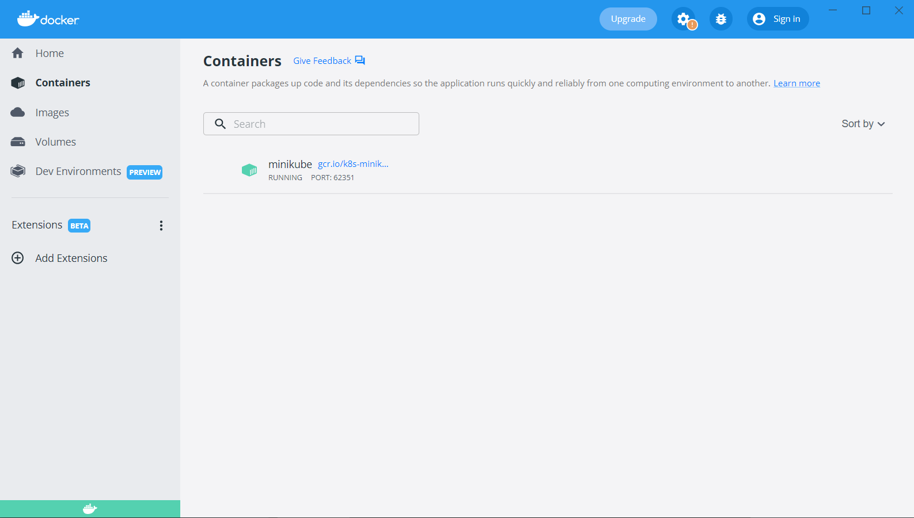
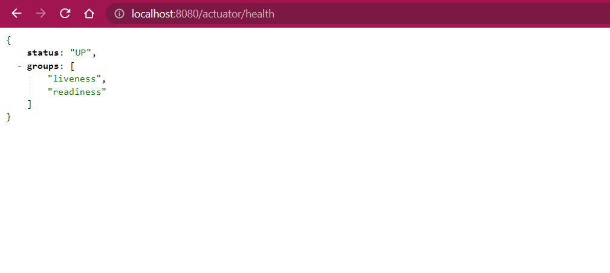

# SPRING BOOT WITH KUBERNETES

#### PRE-REQUISITES
- Docker
- Minikube
- Kubectl 

#### CREATING DOCKER IMAGE
- mvnw clean install -DskipTests     
- docker build -t app:1.0 .
- docker tag app:1.0 mianmahroz/app:1.0
- docker push mianmahroz/app:1.0
- docker run -p 8080:8080 app:1.0 

####  START MINIKUBE
minikube start
minikube dashboard

#### CREATING K& DEPLOYMENT FILE
- kubectl create deployment app --image=mianmahroz/app:1.0 --dry-run -o=yaml > deployment.yaml
- kubectl create service clusterip app --tcp=8080:8080 --dry-run -o=yaml >> deployment.yaml
- kubectl apply -f deployment.yaml
- kubectl get all

#### CREATE SSH TUNNEL TO ACCESS APPLICATION INSIDE K8 MINIKUBE CLUSTER
- kubectl port-forward svc/app 8080:8080

