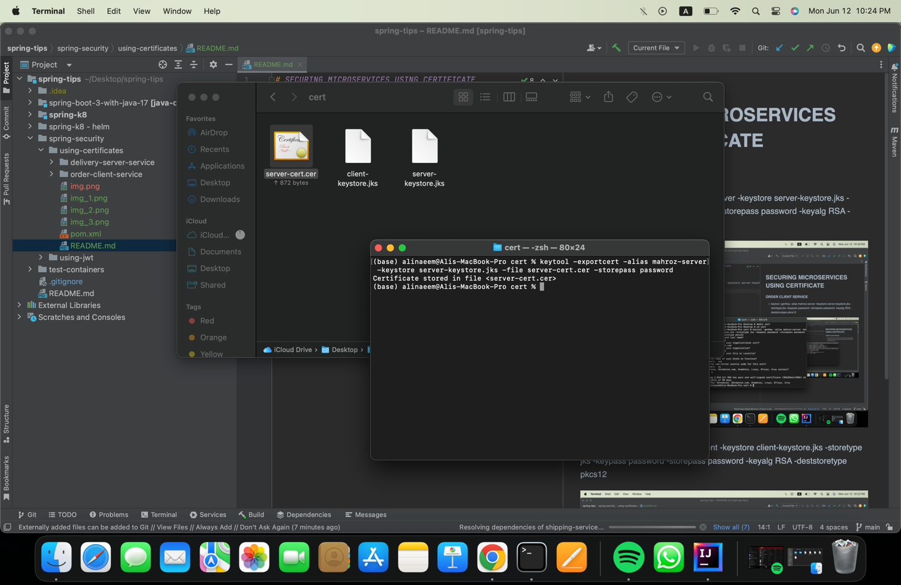
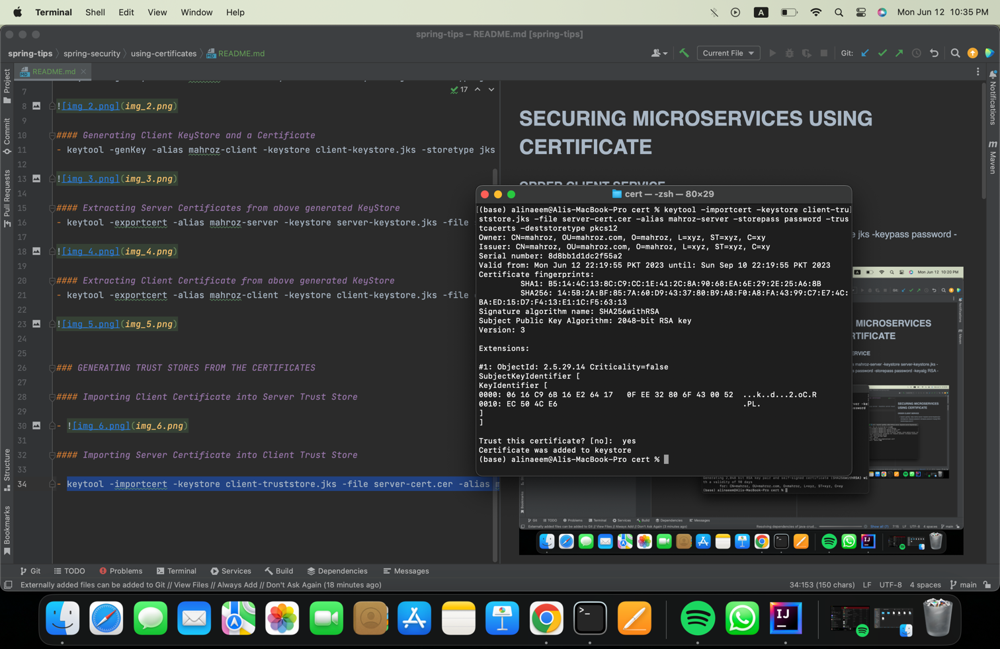

# SECURING MICROSERVICES USING CERTIFICATE

### ORDER CLIENT SERVICE 

#### Generating Server KeyStore and a Certificate
- keytool -genKey -alias mahroz-server -keystore server-keystore.jks -storetype jks -keypass password -storepass password -keyalg RSA -deststoretype pkcs12

#### Generating Client KeyStore and a Certificate
- keytool -genKey -alias mahroz-client -keystore client-keystore.jks -storetype jks -keypass password -storepass password -keyalg RSA -deststoretype pkcs12

#### Extracting Server Certificates from above generated KeyStore
- keytool -exportcert -alias mahroz-server -keystore server-keystore.jks -file server-cert.cer -storepass password

#### Extracting Client Certificate from above generated KeyStore
- keytool -exportcert -alias mahroz-client -keystore client-keystore.jks -file client-cert.cer -storepass password

### GENERATING TRUST STORES FROM THE CERTIFICATES

#### Importing Client Certificate into Server Trust Store

- 

#### Importing Server Certificate into Client Trust Store

- keytool -importcert -keystore client-truststore.jks -file server-cert.cer -alias mahroz-server -storepass password -trustcacerts -deststoretype pkcs12

